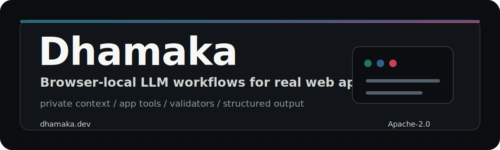

<!-- ╔══════════════════════════════════════════════════════════════════════╗ -->
<!-- ║                                                                      ║ -->
<!-- ║                           D H A M A K A                              ║ -->
<!-- ║                                                                      ║ -->
<!-- ╚══════════════════════════════════════════════════════════════════════╝ -->

<div align="center">

<picture>
  <source media="(prefers-color-scheme: dark)" srcset="./docs/readme-banner.svg">
  <source media="(prefers-color-scheme: light)" srcset="./docs/readme-banner.svg">
  
</picture>

<br/>

**Browser-local LLM workflows for private app context, app tools, validators, and structured output.**

<br/>

[](https://github.com/protosphinx/dhamaka/actions/workflows/ci.yml)
[](./LICENSE)
[](https://dhamaka.dev/evals/)
[](#-tests)<br/>
[](#-what-is-this)
[](#-the-thesis)
[](#-what-is-this)
[](#-download-once-use-everywhere--the-honest-version)
[](#-the-core-api--workflow)
[](#-the-task-registry)<br/>
[](#-the-task-registry)
[](#-the-core-api--workflow)
[](#-the-engine-backends)
[](packages/hub/public/runtime/dhamaka-runtime.wasm)
[](.github/workflows/ci.yml)
[](#end-to-end)

[product site](https://dhamaka.dev/) &nbsp;·&nbsp; [evals](https://dhamaka.dev/evals/) &nbsp;·&nbsp; [source](https://github.com/protosphinx/dhamaka)

</div>

---

## ✦ the thesis

> **Stop sending the data to the model. Ship the model to the data.**

A web application already holds everything an AI call needs to be useful. The user's data is in the tab. The app's schema, state, and affordances are already in JavaScript memory. The actions the user can take are already expressed in code. The only reason AI calls travel to a server is historical — because until very recently, the models were too big to ship.

That's no longer true. Local models are now small enough, fast enough, and good enough to run inside a browser tab. Which means the whole mental model of cloud AI — *data travels to model* — is upside down. Flip it. Ship the model to the data.

Every architectural decision in Dhamaka follows from that one inversion. The product is not a pile of demos and it is not a raw runtime. It is a browser-local workflow layer for serious app work: user intent comes in, app context stays local, the model reasons, tools do exact work, validators decide whether the result can be applied.

- **Workflow** — model-first complex tasks with intent, context, schema, tools, validators, and structured output
- **Transform** — focused instruction-driven rewrites for formulas, DSLs, field values, and structured text
- **Reflex** — narrow UI primitives for smart fields, contextual spellcheck, and smart paste

When in doubt, optimize for this test: *would this call still work if the user's laptop had no network connection and no account with any AI provider?* If yes, it belongs in Dhamaka. If no, it doesn't.

---

## ✦ what is this

**Dhamaka is a JavaScript SDK for browser-local LLM workflows inside real web apps.** No provider account. No API keys. No round trips for private context. The model sees the same app state your UI already has, then returns structured output your code can validate before applying.

It is **not** another general-purpose browser LLM runtime. Chrome's Prompt API, Transformers.js, WebLLM, and wllama already occupy that layer. Dhamaka sits above them as the product layer: workflows, transforms, reflexes, tool calls, validators, engine selection, and browser-native UX.

### Three product surfaces, one SDK

```
  ┌────────────────────────────────────────────────────────────────────┐
  │  Dhamaka — browser-local LLM workflow layer                        │
  ├────────────────────────────────────────────────────────────────────┤
  │                                                                    │
  │  Workflow   model-first app work                                   │
  │             intent · input · context · schema · tools · validators │
  │             use when: the task needs private app state + reasoning │
  │                                                                    │
  │  Transform  focused rewrites and explanations                      │
  │             formulas · DSL snippets · structured text              │
  │             use when: rewrite this X given instruction Y           │
  │                                                                    │
  │  Reflex     narrow UI primitives                                   │
  │             SmartField · SmartForm · SmartText · attachSmartPaste  │
  │             use when: the field itself should feel intelligent     │
  │                                                                    │
  ├────────────────────────────────────────────────────────────────────┤
  │  shared: task registry · reflex service · engine backends          │
  │  (LanguageModel → Transformers.js → WASM → MockEngine)             │
  └────────────────────────────────────────────────────────────────────┘
```

All three surfaces share the same engine, the same task registry, and the same deploy story. The important bit is the trust boundary: the model can reason, but the app owns tools, permissions, and validation.

---

## ✦ latest snapshot

As of **May 24, 2026**, the live product site is [dhamaka.dev](https://dhamaka.dev/) and the current public SDK surface is:

- `Workflow.run()` for model-first browser-local workflows with app context, tools, validators, confidence, and review state
- `Transform` for focused formula rewrites, explanations, and debugging
- `SmartField`, `SmartForm`, `SmartText`, and `attachSmartPaste` for narrow UI primitives

Current evals are published at [dhamaka.dev/evals](https://dhamaka.dev/evals/): **64/65 deterministic task evals passing**, **18/18 model fallback/runtime checks passing**, and **17/17 product budget checks passing**. The one published miss is `too -> to` in contextual spellcheck, which stays visible so regressions and gaps are not hidden.

**Release status:** the npm package currently published as `dhamaka@0.1.0` is older than this repository snapshot. It still advertises the pre-Workflow reflex API and MIT license metadata. Use the repo source for the current Workflow API until the package is republished from `packages/sdk`.

---

## ✦ the core API — Workflow

Workflow is the product surface. It is what you use when a real app task needs private state, model reasoning, exact tools, and validation: invoice imports, formula edits, CRM cleanup, policy checks, schema mapping, spreadsheet operations, and internal workflows.

```js
import { Workflow } from "dhamaka";
const workflow = new Workflow({ backend: "auto" });

const result = await workflow.run({
  intent: "Turn this invoice email into an AP draft.",
  input: emailText,
  context: {
    vendorSchema,
    openPurchaseOrders,
    selectedCompany,
  },
  schema: {
    invoiceNo: "string",
    total: "number",
    dueDate: "string",
    reviewFlags: ["string"],
  },
  tools: [{
    name: "matchPurchaseOrder",
    description: "Find a likely PO by vendor and amount",
    run: ({ vendor, total }) => matchPurchaseOrder(vendor, total),
  }],
  validators: [
    (r) => r.output.total > 0 || "missing total",
    (r) => r.confidence >= 0.7 || "low confidence",
  ],
});

if (!result.needsReview) applyDraft(result.output);
else showReview(result);
```

The model does the messy reasoning over user intent and app context. Your app still owns the action layer: calculators, lookups, parsers, permissions, persistence, and review gates.

## ✦ the hero use case — private formula work

```js
import { Workflow } from "dhamaka";
const workflow = new Workflow({ backend: "auto" });

// User selects a cell showing `=SUM(A1:A10) * 1.08` and types
// "add a 10% discount for employees"
const r = await workflow.run({
  intent: "Add a 10% discount for employees.",
  input: "=SUM(A1:A10) * 1.08",
  context: { dialect: "excel", headers: ["amount", "isEmployee"] },
  schema: { formula: "string", explanation: "string" },
  tools: [{
    name: "rewriteFormula",
    description: "Safely rewrite an Excel formula",
    run: rewriteFormula,
  }],
  validators: [
    (r) => String(r.output.formula || "").startsWith("=") || "not a formula",
  ],
});
// r.output.formula → "=(SUM(A1:A10) * 1.08) * 0.9"
// r.needsReview    → false
// r.confidence     → 0.94
```

Dhamaka's formula story is not "a formula demo." ERP formulas contain pricing models, margins, payroll math, commission tiers, inventory rules, and compliance checks. The point is to let a local model understand the requested change while deterministic tools perform exact rewrites and validators decide whether the output is safe to apply.

More formula-family calls on the same primitive:

```js
import { Transform } from "dhamaka";
const transform = new Transform();

// Explain a formula in plain English
await transform.explain("=IFERROR(VLOOKUP(A2, Prices!A:B, 2, FALSE), 0)");
// → "This formula uses IFERROR catches errors from the wrapped expression…
//    and VLOOKUP looks up a value in the first column of a table…"

// Diagnose and fix a broken formula
await transform.debug("=A1/B1", { error: "#DIV/0!" });
// → "The formula is dividing by a zero or empty cell. Wrap the denominator
//    in IFERROR: =IFERROR(A1/B1, 0)."
```

Every one of these runs on-device. Fast paths are instant; model paths stay local and provider-free. None of them touch a server erp.ai has to run or pay for.

---

## ✦ other use cases this unlocks

The pattern generalises to **any web app where AI calls need to be free, private, instant, and cross-browser** — i.e. almost any app where users are typing real data into real forms:

**ERP / finance / analytics**
- Formula editing, explanation, debugging (the erp.ai integration above)
- Natural-language filters over spreadsheet ranges
- "Find the anomaly in this column" / "what's driving this trend"
- Smart CSV import: auto-detect headers, map to schema, flag bad rows

**Forms / checkout / onboarding**
- Type "San Francisco" → state, country, timezone, currency populate live
- Smart paste: business cards split into name / email / phone / company
- Contextual spellcheck that catches "see you their" and "your welcome"
- Cross-field inference: ZIP → city, email domain → company, date range → duration

**Writing tools**
- Tone rewriting ("make it formal / shorter / friendlier") on any `<textarea>`
- Inline translation as the user types in a different language
- Proofreading with context-aware suggestions

**Internal tools / admin panels**
- Natural-language search over in-memory tables
- "Fix this row's data" / "what fields are missing" / "is this a duplicate"
- Free-text classification of incoming records

Every one of these is impossible as a server-side product because network latency, per-call cost, privacy exposure, rate limits, or offline support kills it. Every one becomes trivial when inference is free and local.

---

## ✦ proof surfaces

Spin up the dev stack (`npm run dev`) and open <http://localhost:5173> to try them live:

| demo | family | what it shows | primitive |
|---|---|---|---|
| **[Address autofill](packages/playground/public/demos/autofill.html)** | Reflex | City → state / country / timezone / currency populate synchronously | `SmartField` + `SmartForm` |
| **[Contextual spellcheck](packages/playground/public/demos/spellcheck.html)** | Reflex | Homophone-in-context detection, not just dictionary matches | `SmartText` |
| **[Smart paste](packages/playground/public/demos/paste.html)** | Reflex | Paste a contact blob, watch it split into the right fields | `attachSmartPaste` |
| **[Formula editor](packages/playground/public/demos/formula.html)** | Transform | erp.ai-style spreadsheet, live formula rewrites from plain-English instructions | `Transform.formula()` |

The `dhamaka.dev` website source lives in [`packages/playground/public`](packages/playground/public). Run `npm run build:site` to rebuild the static deploy bundle in `dist/`.

---

## ✦ the stack

```
  ┌──────────────────────────────────────────────────────────────────────┐
  │  your app                                                            │
  │                                                                      │
  │   import screen     formula editor     textarea      form fields      │
  │        │                 │                │              │            │
  │        ▼                 ▼                ▼              ▼            │
  │  ╔════════════════════════════╗ ╔══════════════════════════════════╗ │
  │  ║      Workflow              ║ ║     Transform + Reflex           ║ │
  │  ║ intent · input · context   ║ ║ focused rewrites + UI helpers     ║ │
  │  ║ schema · tools · validators║ ║ SmartField · SmartText · paste    ║ │
  │  ╚═════════════╦══════════════╝ ╚═══════════════╦══════════════════╝ │
  │                │                                │                     │
  │                └────────────────┬───────────────┘                     │
  │                                 ▼                                     │
  │         ┌────────────────────────────────────────────┐                │
  │         │  tools + task registry + validators        │                │
  │         │  formula rewrites · parsers · lookups      │                │
  │         │  city-to-state · spellcheck · paste-extract│                │
  │         │  exact paths feed or check model output    │                │
  │         └──────────────────┬─────────────────────────┘                │
  │                            │                                         │
  │                            ▼                                         │
  │         ┌────────────────────────────────────────────────────┐        │
  │         │  engine backends (auto-selected by factory)        │        │
  │         │  ┌───────────────┐ ┌───────────────┐ ┌──────────┐ │        │
  │         │  │ LanguageModel │ │ Transformers  │ │ WASM /   │ │        │
  │         │  │ Prompt API    │ │     .js       │ │ Mock     │ │        │
  │         │  │ Gemini Nano   │ │ real LLMs     │ │ tests    │ │        │
  │         │  └───────────────┘ └───────────────┘ └──────────┘ │        │
  │         │           ↑               ↑              ↑         │        │
  │         │           └── auto pick in priority order ──┘      │        │
  │         └────────────────────────────────────────────────────┘        │
  └──────────────────────────────────────────────────────────────────────┘
```

**The shape that matters:** Dhamaka is the **product layer above the runtime**. The SDK is split into Workflow, Transform, and Reflex surfaces that share everything below them: task registry, reflex service, engine backends, tools, and validators. The runtime underneath is a swappable dependency: Chrome's Prompt API when present, otherwise `@huggingface/transformers` loaded lazily from `esm.sh`. The Rust crate in `crates/dhamaka-runtime` is a v2 swap target, not the primary runtime: Transformers.js has years of quantization, BPE tokenization, and ONNX/WebAssembly runtime work we're not going to reinvent, and trying to be *both* the product layer and the runtime would mean fighting HuggingFace on a layer they'll always win. We pick the product layer and let them pick the runtime.

| package | what it does |
|---|---|
| [`dhamaka`](packages/sdk)              | **public SDK**: `Workflow`, `Transform`, `SmartField`, `SmartForm`, `SmartText`, `attachSmartPaste`, task registry, reflex service. The thing you actually install. |
| [`@dhamaka/runtime`](packages/runtime) | engine backends: `WindowAiBackend` → `TransformersBackend` → `WasmEngine` → `MockEngine`, plus the factory that picks one |
| [`dhamaka-runtime` (Rust)](crates/dhamaka-runtime) | the compiled v2 runtime — matmul, RMSNorm, softmax, RoPE, KV-cache, sampling — 55 KB `.wasm`. Architecture is done; real weights, Q4 quantization, and SIMD128 are the missing pieces before this replaces Transformers.js as the primary backend |
| [`@dhamaka/hub`](packages/hub)         | static origin hosting the cross-site model cache + `.wasm` runtime |
| [`@dhamaka/extension`](packages/extension) | Manifest V3 browser extension — shared cache across every site on the machine |
| [`@dhamaka/playground`](packages/playground) | zero-dep dev server running hub + playground + proof surfaces for Workflow, Transform, and Reflex |

---

## ✦ the task registry

Developers think in **tasks**, not in models. Each task is a small, typed function that turns an input (plus optional instruction and context) into a structured inference. The SDK decides what runs: a lookup table, regex, fuzzy match, pattern rewrite, app tool, validator, or browser-local LLM. Registered tasks are available to every product surface that wants them.

### Reflex tasks

| task id              | what it does                                                       | backend layers                             |
|----------------------|--------------------------------------------------------------------|--------------------------------------------|
| `city-to-state`      | city → state, country, timezone, currency                          | gazetteer → fuzzy → LLM                    |
| `spellcheck`         | misspellings + homophone-in-context                                | dictionary → context regex → masked LM     |
| `paste-extract`      | contact blob → name / email / phone / company / website / twitter  | regex → heuristic → LLM                    |

### Transform tasks

| task id              | what it does                                                       | backend layers                             |
|----------------------|--------------------------------------------------------------------|--------------------------------------------|
| `formula-transform`  | rewrite a spreadsheet / ERP formula from a plain-English instruction | pattern rewrites → LLM                   |
| `formula-explain`    | explain what a formula does in plain English                       | function gloss table → LLM                 |
| `formula-debug`      | diagnose a formula error and suggest a fix                         | error-code advice → LLM                    |

`registerTask(customTask)` lets any app ship domain tools on top of the same pipeline. A product-specific transformation, parser, calculator, or validator can plug into Dhamaka without forking the SDK.

---

## ✦ the engine backends

One `Engine` interface, four implementations, auto-selected by the factory in priority order. The SDK surface never moves when the runtime swaps.

```
  ┌───────────────────────┬────────────────────────────────────────────────┐
  │ WindowAiBackend       │ Chrome Prompt API / Gemini Nano.               │
  │ (priority 1)          │ Resident, free, GPU-accelerated. Wins on       │
  │                       │ Chrome when available. Shared with the browser │
  │                       │ so the user pays nothing for the download.     │
  ├───────────────────────┼────────────────────────────────────────────────┤
  │ TransformersBackend   │ @huggingface/transformers v3, lazily imported  │
  │ (priority 2)          │ from esm.sh the first time an engine is        │
  │                       │ instantiated. Real LLMs (SmolLM2-135M,         │
  │ ← primary today       │ LaMini-Flan-T5-248M, distilBERT, MiniLM        │
  │                       │ embeddings). ~90–250 MB first-visit download,  │
  │                       │ cached in IndexedDB forever after. Works on    │
  │                       │ every browser with WebAssembly + fetch.        │
  ├───────────────────────┼────────────────────────────────────────────────┤
  │ WasmEngine            │ Our Rust runtime compiled to a 55 KB .wasm.    │
  │ (priority 3)          │ Architecture complete (matmul, RMSNorm,        │
  │                       │ softmax, RoPE, KV-cache, sampling) with 27     │
  │ ← v2 swap target      │ cargo tests. Not primary yet: needs Q4         │
  │                       │ quantization + SIMD128 + real SmolLM2 weights  │
  │                       │ before it can compete with Transformers.js on  │
  │                       │ model coverage or inference speed.             │
  ├───────────────────────┼────────────────────────────────────────────────┤
  │ MockEngine            │ Canned-response stand-in for Node + tests.     │
  │ (priority 4)          │ Zero dependencies, fully deterministic. Never  │
  │                       │ used in a browser.                             │
  └───────────────────────┴────────────────────────────────────────────────┘
```

On a typical modern Chrome with the Prompt API enabled: the browser-resident model wins, nothing downloads, and model calls stay local. On Firefox / Safari / older Chromes: Transformers.js wins, first visit waits 30–90 seconds for the model download, every visit after that is cached and offline. On Node (tests, SSR): `MockEngine` wins so CI never tries to download a language model.

In browsers, the factory prefers `LanguageModel`, falls back to the legacy `window.ai.languageModel` preview shape when present, then Transformers.js, WASM, and MockEngine. Same SDK surface either way.

---

## ✦ five-minute quickstart

### use the current source

```js
import { Workflow } from "dhamaka";

const workflow = new Workflow({ backend: "auto" });

const result = await workflow.run({
  intent: "Map this pasted CSV row to our customer schema.",
  input: pastedRow,
  context: { schema: customerSchema },
  validators: [(r) => r.output.email || "missing email"],
});

if (!result.needsReview) saveCustomer(result.output);
```

In this repository, the playground import map aliases `dhamaka` to `packages/sdk/src`, so the current Workflow API is available immediately in local development. See **[the API](#-the-api)** below for the full surface.

### run the repo

```bash
git clone https://github.com/protosphinx/dhamaka
cd dhamaka
npm install

# one-time: compile the Rust runtime to WebAssembly
crates/dhamaka-runtime/build.sh

# run the dev stack
npm run dev
```

```
  ✦ hub         http://localhost:5174
  ✦ playground  http://localhost:5173

  Dhamaka dev stack running. Ctrl+C to stop.
```

Open **http://localhost:5173** and click into the demos. The playground hot-reads the SDK + runtime sources, so every JS edit shows up on refresh. Re-run `build.sh` only when editing the Rust runtime.

> Don't have Rust installed? The compiled `.wasm` is checked in under `packages/hub/public/runtime/` so `npm run dev` works on a fresh clone too. Install Rust only if you want to modify the inference engine itself.

---

## ✦ the API

Dhamaka ships three product surfaces today. Pick the one that matches the shape of what you're building: **Workflow** for complex app work with private context, **Transform** for imperative one-shot "rewrite this X given instruction Y" calls, and **Reflex** for reactive keystroke-level intelligence on `<input>` and `<textarea>` elements.

### Workflow — model-first app work

```js
import { Workflow } from "dhamaka";

const workflow = new Workflow({
  backend: "auto", // LanguageModel → Transformers.js → WASM → MockEngine
});

const result = await workflow.run({
  intent: "Check whether this discount policy can apply to the selected order.",
  input: policyText,
  context: {
    order,
    customer,
    activePriceBook,
    userPermissions,
  },
  schema: {
    allowed: "boolean",
    reason: "string",
    requiredApproval: "string|null",
  },
  tools: [{
    name: "calculateMargin",
    description: "Return margin after discount",
    run: calculateMargin,
  }],
  validators: [
    (r) => typeof r.output.allowed === "boolean" || "missing decision",
    (r) => r.output.allowed !== true || r.confidence >= 0.8 || "approval required",
  ],
});

if (result.needsReview) showReview(result);
else applyDecision(result.output);
```

`Workflow.run()` always returns a structured object with `source`, `action`, `summary`, `output`, `toolCalls`, `toolResults`, `confidence`, `needsReview`, `validation`, `raw`, and `backend`. That makes the browser LLM useful inside product flows instead of sitting beside them as a chat box.

### 🪞 Reflex family — reactive, continuous, deterministic where possible

#### `SmartField` — one field, one task

```js
import { SmartField } from "dhamaka";

new SmartField(document.querySelector("#city"), {
  task: "city-to-state",
  onResult: (r) => {
    // r.source      → "rule" | "fuzzy" | "model"
    // r.confidence  → 0..1
    // r.fields      → { state, stateName, country, countryName, tz, currency }
  },
});
```

Every keystroke fires the task. Deterministic paths answer common inputs in under a millisecond; the task registry decides when the local model is the right layer.

#### `SmartForm` — cross-field inference

```js
import { SmartField, SmartForm } from "dhamaka";

const form = document.querySelector("#checkout");

new SmartForm(form, {
  tasks: { city: "city-to-state" },           // auto-attach a SmartField
  infer: {
    "city → state":    "city-to-state:stateName",
    "city → country":  "city-to-state:countryName",
    "city → timezone": "city-to-state:tz",
    "city → currency": "city-to-state:currency",
  },
});
```

Type "San Francisco" in the city field, the state / country / timezone / currency fields fill themselves from the same task result — synchronously, no debounce, no network. Manually edit any target field and it's locked out of automatic propagation until `smartForm.unlock()`.

#### `SmartText` — contextual spellcheck on every textarea

```js
import { SmartText } from "dhamaka";

const textarea = document.querySelector("textarea");

const smart = new SmartText(textarea, {
  onSuggestions: (suggestions) => {
    // [{ from: "their", to: "there", index: 14, reason: "homophone in context" }]
    renderSuggestionChips(suggestions);
  },
});

// Apply a suggestion by index
smart.applySuggestion(0);
```

Catches classic homophone-in-context mistakes ("see you their", "your welcome", "alot of", "its a good idea") that a plain dictionary spellchecker misses.

#### `attachSmartPaste` — any form, any blob

```js
import { attachSmartPaste } from "dhamaka";

const form = document.querySelector("#contact-form");
attachSmartPaste(form, {
  dropZone: document.querySelector("#paste-zone"),
});

form.addEventListener("smart-paste:extracted", (e) => {
  console.log("filled", e.detail.result.fields);
});
```

Paste a contact blob (business card, signature, LinkedIn blurb) and the `name`, `email`, `phone`, `company`, `website`, `twitter` fields populate themselves. Fields the user has already typed into are never overwritten.

### 🔧 Transform family — imperative, one-shot, instruction-driven

#### `Transform` — generic "input + instruction + context → output"

```js
import { Transform } from "dhamaka";

const t = new Transform();

// Generic one-shot via any registered task
const r = await t.run({
  task: "formula-transform",
  input: "=SUM(A1:A10) * 1.08",
  instruction: "add a 10% discount for employees",
  context: { dialect: "excel", headers: ["amount", "isEmployee"] },
});
// r.output      → "=(SUM(A1:A10) * 1.08) * 0.9"
// r.source      → "rule"         (pattern matched the fast path)
// r.confidence  → 0.95
// r.explanation → "Multiplied by 0.9 to apply a 10% discount."
```

One call, one answer, all local. If a deterministic formula tool can handle the instruction it resolves in microseconds with zero model calls. Otherwise it escalates to the browser-local LLM with a structured prompt including context, dialect, and schema hints; the app gets one result shape either way.

#### `Transform.formula` / `.explain` / `.debug` — formula shortcuts

Convenience wrappers for the three shipping formula tasks, so erp.ai-style integrations are one import and three methods:

```js
const t = new Transform();

// Rewrite a formula from a natural-language instruction
await t.formula("=SUM(A1:A10) * 1.08", "add a 10% discount for employees");
// → { output: "=(SUM(A1:A10) * 1.08) * 0.9", source: "rule", confidence: 0.95 }

// Explain a formula in plain English
await t.explain("=IFERROR(VLOOKUP(A2, Prices!A:B, 2, FALSE), 0)");
// → { output: "This formula uses IFERROR catches errors… and VLOOKUP looks up…" }

// Diagnose an error and suggest a fix
await t.debug("=A1/B1", { error: "#DIV/0!" });
// → { output: "The formula is dividing by a zero or empty cell. Wrap…" }
```

Every call runs 100% in the browser tab. No network, no API key, no per-call cost, no rate limit, no data leaving the user's machine — which is what makes this integration viable for products like erp.ai where formulas contain pricing, margins, payroll math, and commission tiers that cannot be sent to a third-party AI provider under any circumstances.

#### Registering your own transform task

Every Dhamaka-powered app can register custom tasks that work as local tools, fast paths, or validators around the model workflow:

```js
import { registerTask, Transform } from "dhamaka";

registerTask({
  id: "product-sku-normalize",
  description: "Normalize messy product SKUs to the canonical format",
  fast(input) {
    const m = input.match(/^([A-Z]{2,4})[-_\s]?(\d{4,8})$/i);
    if (!m) return null;
    return {
      confidence: 0.95,
      source: "rule",
      fields: { output: `${m[1].toUpperCase()}-${m[2]}` },
    };
  },
  async slow(input, _ctx, engine) {
    const prompt = `Normalize this SKU to "XX-NNNN" format: "${input}". SKU:`;
    const out = await engine.complete(prompt, { temperature: 0 });
    return { confidence: 0.6, source: "model", fields: { output: out.trim() } };
  },
});

// Now any Transform call with task: "product-sku-normalize" works
await new Transform().run({ task: "product-sku-normalize", input: "abc 123456" });
```

### Configure the engine (optional)

```js
import { reflex } from "dhamaka";

reflex.configure({
  backend: "auto",            // "window-ai" | "transformers" | "wasm" | "mock" | "auto"
  wasmUrl: "/runtime/dhamaka-runtime.wasm",
});
```

Most apps never call this. `auto` picks the fastest backend available: Chrome Prompt API, then Transformers.js, then the compiled Rust `.wasm`, then `MockEngine`.

### Legacy: raw `Dhamaka.load()` for direct model access

For apps that want raw completion / streaming / chat (LLM chatbots, content generation, etc.) instead of the workflow surface, the lower-level class is still available:

```js
import { Dhamaka } from "dhamaka";

const llm = await Dhamaka.load();
for await (const token of llm.stream("hello")) process.stdout.write(token);
```

And the drop-in OpenAI `/v1/chat/completions` shim:

```js
import { installOpenAIShim } from "dhamaka/openai";
installOpenAIShim(llm);
```

---

## ✦ download once, use everywhere — the honest version

Modern browsers increasingly **partition third-party storage** by the top-level site for privacy. That makes the classic "shared iframe" trick weaker than it used to be. Dhamaka handles this by degrading gracefully at three tiers:

```
  ╭──────────────────────────────────────────────────────────────╮
  │                                                              │
  │   tier 1 · shared hub iframe  (the dream)                    │
  │            one download per user, across all Dhamaka sites   │
  │            ↓ falls back to ↓                                 │
  │                                                              │
  │   tier 2 · Storage Access API                                │
  │            user-gated unpartitioned access when available    │
  │            ↓ falls back to ↓                                 │
  │                                                              │
  │   tier 3 · per-origin IndexedDB                              │
  │            still private, still offline, still fast —        │
  │            just one download per origin instead of one per   │
  │            user                                              │
  │                                                              │
  │   tier 4 · (phase 2) a browser extension                     │
  │            sidesteps partitioning entirely, one local cache  │
  │            for every site on the machine                     │
  │                                                              │
  ╰──────────────────────────────────────────────────────────────╯
```

`Dhamaka.hub.mode()` tells your app which tier it actually got, so you can show a "⚡ shared cache hit" badge when it matters and silently degrade when it doesn't.

---

## ✦ what's real today

```
  Workflow
  [x]  Workflow.run() — model-first browser-local workflows with intent,
       input, context, schema, tools, validators, confidence, review state,
       raw model output, and backend metadata.

  Transform
  [x]  Transform.run()       — generic task-routed transforms
  [x]  Transform.formula()   — rewrite formulas from natural language
  [x]  Transform.explain()   — explain formulas in plain English
  [x]  Transform.debug()     — diagnose formula errors and suggest fixes

  Reflex
  [x]  SmartField            — task-routed input intelligence
  [x]  SmartForm             — cross-field inference with manual-edit locks
  [x]  SmartText             — contextual spellcheck on textareas
  [x]  attachSmartPaste      — pasted blobs into structured fields

  Local backends
  [x]  WindowAiBackend       — current LanguageModel Prompt API plus
                               legacy window.ai.languageModel compatibility
  [x]  TransformersBackend   — @huggingface/transformers v3 via esm.sh
  [x]  WasmEngine            — compiled Rust fallback runtime
  [x]  MockEngine            — deterministic Node/test stand-in
  [x]  createEngine()        — LanguageModel → Transformers.js → WASM → mock

  Product proof
  [x]  Address autofill, spellcheck, smart paste, and formula demos
  [x]  Deterministic task evals and browser budgets on dhamaka.dev/evals
  [x]  Node test suite covering runtime, tasks, SDK, Workflow, and shims
  [x]  GitHub Actions CI for Rust, JS, wasm, and site smoke tests
```

**Honesty note:** the strongest model path today is the browser Prompt API when available, then Transformers.js when the browser needs a cross-browser model runtime. The Rust WASM runtime is wired in as a fallback target and test surface, but it is not the primary quality path yet. Deterministic tasks remain valuable as tools and validators around model workflows, not as the headline product.

---

## ✦ tests

```
  ╭─────────────────────────────────────────────────────────────╮
  │                                                             │
  │          27 rust tests  ·  97 js tests  ·  124 total        │
  │                                                             │
  ╰─────────────────────────────────────────────────────────────╯
```

### run them

```bash
# everything (Rust native + JS + end-to-end wasm)
cargo test --manifest-path crates/dhamaka-runtime/Cargo.toml
npm test

# just the Rust crate
cd crates/dhamaka-runtime && cargo test

# just the JS side
npm test

# one specific file
node --test packages/runtime/test/wasm-engine.test.js
```

Zero test-runner dependencies. Rust uses `cargo test`, JS uses the Node 20+ built-in `node --test`. No jest, no mocha, no vitest, no install step past `rustup` and the Node toolchain.

### Rust · `cargo test` · 27 tests

The hot path. Every tensor primitive, the sampler, the forward pass, and the model init are covered by native unit tests that run in milliseconds.

| file                         | tests | what it covers                                                                 |
|------------------------------|:-----:|---------------------------------------------------------------------------------|
| `src/rng.rs`                 |   4   | xorshift64* determinism, `next_f32()` range, FNV-1a seed-hash distinctness      |
| `src/tensor.rs`              |  10   | matmul (identity + 2×2 reference), RMSNorm, softmax sums to 1 + translation invariance, SiLU at 0 and large positive, in-place add/mul, RoPE identity at pos 0 + norm preservation |
| `src/sampler.rs`             |   5   | greedy picks max, temperature=0 is greedy, deterministic for same seed, `top_k=1` always hits argmax, `top_p=0.01` collapses to the mode |
| `src/transformer.rs`         |   3   | forward pass produces finite logits, is deterministic for same seed, **different positions produce different logits** (caught a real KV-cache bug) |
| `src/model.rs`               |   5   | random-weights init is reproducible, different seeds differ, vocab table size, detokenize round-trip, empty prompt still yields a token |

### JavaScript · `npm test` · 97 tests

Drives the SmartField SDK, the hub, the tasks pipeline, and the real compiled `.wasm` end-to-end from Node using the built-in test runner. Zero dependencies.

| file                                        | tests | what it covers                                                                    |
|---------------------------------------------|:-----:|------------------------------------------------------------------------------------|
| `packages/sdk/test/tasks.test.js`           |  30   | city-to-state, spellcheck, paste-extract, task registry, and runTask contracts |
| `packages/sdk/test/workflow.test.js`        |   8   | structured model output, prompt construction, fenced/unstructured JSON, validators, tool execution, missing tools, intent validation |
| `packages/sdk/test/smart-field.test.js`     |   5   | resolves on construction, fires `smart-field:resolved` event, re-runs on every input, `dispose` stops listening, bad-arg rejection |
| `packages/sdk/test/smart-form.test.js`      |   5   | cross-field propagation (city → state/country/timezone), manual-edit locks, `unlock()` re-engages, `tasks` auto-attach, non-form rejection |
| `packages/sdk/test/chat.test.js`            |   6   | history accumulation, system prompt, streaming transcript, reset with/without system |
| `packages/sdk/test/hub-client.test.js`      |   5   | Node fallback mode, ping, get with mocked fetch (cache miss then hit), list + delete, unknown-model error |
| `packages/sdk/test/openai-shim.test.js`     |   3   | non-streaming ChatCompletion shape, streaming SSE with `[DONE]`, passthrough for non-matching URLs |
| `packages/runtime/test/factory.test.js`     |   7   | backend selection (auto / mock / wasm / window-ai), abstract `Engine` refuses instantiation, `WasmEngine` info + unreachable-url error |
| `packages/runtime/test/mock-engine.test.js` |   7   | load gating, streaming, `complete()`, determinism, `AbortSignal`, unload          |
| `packages/runtime/test/tokenizer.test.js`   |   8   | `split()` on words / punctuation / whitespace / empty, JSON `loadFromBytes`, encode/decode stubs |
| `packages/runtime/test/wasm-engine.test.js` |   4   | **loads the real compiled `.wasm`**, streams real Rust forward-pass tokens, deterministic across identical prompts, honors `AbortSignal` |
| `packages/runtime/test/window-ai-backend.test.js` |   4   | current `LanguageModel` Prompt API, legacy preview compatibility, unavailable model rejection, unavailable environment |
| `packages/hub/test/manifest.test.js`        |   5   | canonical manifest parses, model ids + required fields, sha256 format, default model exists, served hub manifest mirrors shape |

### end-to-end

The four `wasm-engine.test.js` tests are the moat. They stub `globalThis.fetch` to read the compiled `dhamaka-runtime.wasm` off disk, then drive the real ABI:

```
┌─ Node ────────────────────────────────────────────────────────────┐
│  WasmEngine                                                       │
│      │                                                            │
│      │  WebAssembly.instantiate(fs.readFile(.wasm))                │
│      ▼                                                            │
│  [ dhamaka_version   ==> 1                               ]        │
│  [ dhamaka_alloc     ==> ptr                             ]        │
│  [ write prompt bytes into WASM linear memory            ]        │
│  [ dhamaka_init      ==> ctx                             ]        │
│  [ dhamaka_feed_prompt(ctx, ptr, len)                    ]        │
│  [ loop { dhamaka_next_token(ctx, out, 64) ==> n bytes } ]        │
│  [ decode UTF-8, yield token                             ]        │
└───────────────────────────────────────────────────────────────────┘
```

These four pass in Node, so every token in the README's "real today" list is real. The same `WasmEngine` runs in the browser via `instantiateStreaming` — no fork.

### CI

`.github/workflows/ci.yml` runs on every push and pull request:

```
  ┌─────────────────────────┐
  │ job 1 · rust            │
  │   rustup target add     │
  │     wasm32-unknown-     │
  │     unknown             │
  │   cargo test            │─── 27 tests
  │   cargo build --release │
  │     --target wasm32-…   │─── stage .wasm artifact
  └───────────┬─────────────┘
              │
              ▼
  ┌─────────────────────────┐
  │ job 2 · js              │
  │   download wasm artifact│
  │   node --check **/*.js  │
  │   npm test              │─── 97 tests
  │   smoke-test dev server │─── curl every endpoint
  └─────────────────────────┘

          matrix: node 20, node 22
```

No green CI, no merge.

---

## ✦ philosophy

```
   ┌───────────────────────────────────────────────────────────┐
   │                                                           │
   │   nothing leaves the device.                              │
   │                                                           │
   │   no api keys. no accounts. no rate limits. no 429s.      │
   │   no "our servers are experiencing issues". no bill.      │
   │                                                           │
   │   your prompts are yours. your model is yours.            │
   │   your tab is the datacenter.                             │
   │                                                           │
   └───────────────────────────────────────────────────────────┘
```

---

## ✦ license

Apache-2.0. See [LICENSE](./LICENSE).

<div align="center">

```
      ✦ ─ ─ ─ ─ ─ ─ ─ ─ ─ ─ ─ ─ ─ ─ ─ ─ ─ ─ ─ ─ ─ ─ ─ ─ ─ ─ ✦

                     built for the open web
                     runs on your machine
                     shared across every site

      ✦ ─ ─ ─ ─ ─ ─ ─ ─ ─ ─ ─ ─ ─ ─ ─ ─ ─ ─ ─ ─ ─ ─ ─ ─ ─ ─ ✦
```

</div>
